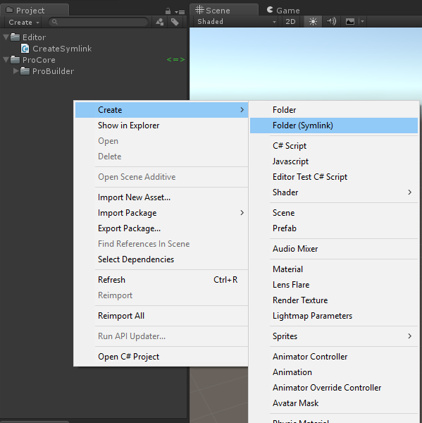

# unity-symlink-utility

A small extension that adds a menu item to add folders as symlinks in Unity.

**A warning from Unity**

> Using symlinks in Unity projects may cause your project to become corrupted if you create multiple references to the same asset, use recursive symlinks or use symlinks to share assets between projects used with different versions of Unity. Make sure you know what you are doing.

Basically just don't create multiple symlinks pointing to the same folder, and don't make symlinks inside symlinks.

## Quick Start

- Open the menu item `Assets > Create > Folder (Symlink)`
- Choose the directory source

New symlinks are placed in the selected directory, named to match the source folder.
